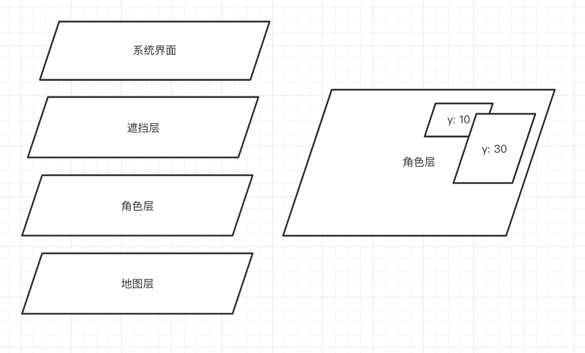
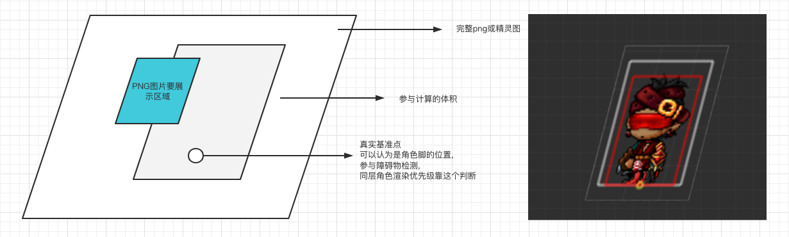
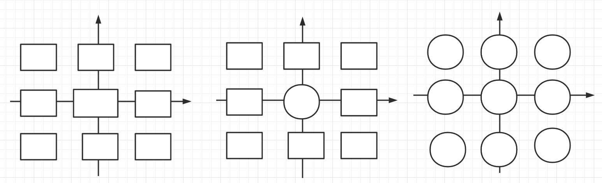
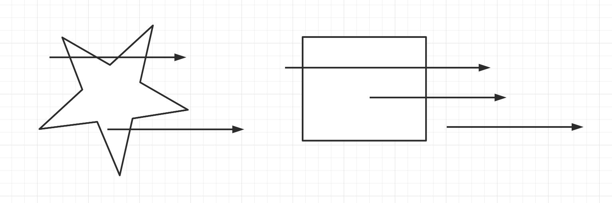
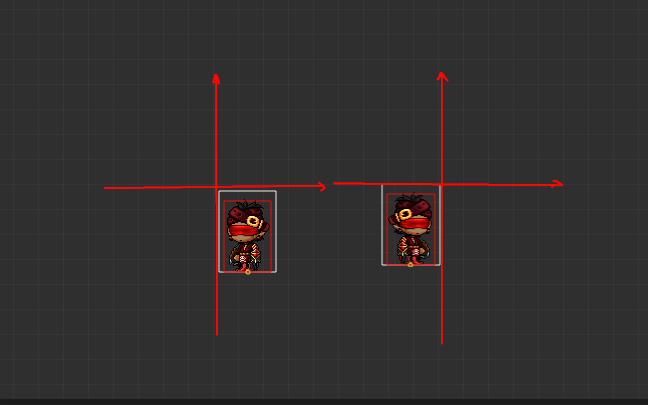

## 开篇

作为前端研发, 从jq时代末期,到vue,react兴起,rn跨端,小程序接力,搞来搞去都是这些东西着实有些疲倦。

从小到大接触到的游戏很多,想尝试写一个自己的游戏。

Unity跟UE上手成本高,用闲暇时间开发进展慢,设计资源贵(穷)。 Cocos,白鹭,上手快,但对底层实现不明白的话,感觉没多大意义。 因此打算自己用canvas加原生js,基于个人对游戏的理解,实现一个可交互的帧动画项目。如果可能,可以抽些功能做一个小引擎。

以下内容均是个人探索,一方面记录,另一方面分享给有同样兴趣的同仁。

ps: 2022年春节, 支付宝跟京东都搞了打年兽项目,仍然是营销场景,但是用户体验跟游戏无异,不清楚他们用了什么框架, 但是属于个人对可交互帧动画的定义。

  [可交互帧动画]
## 可交互帧动画

交互式帧动画是个人的一个定义, 本质是帧动画, 用户可以通过操作, 影响帧动画的结果, 实现交互功能。
简单的说,比如狂野飙车、马里奥赛车这种游戏,通用操作方向,帧动画的结果就是平稳的抵达终点或者撞车。

大部分游戏都可以理解成可交互帧动画这个概念, 用户使用设备实现交互, 体验不同的帧动画结果, 掌握技巧获取激励。
又比如说原神的一些过场动画,比如烤鱼活动H5,点击之后会有不同动画效果, 这也是交互式帧动画。

相信随着前端的逐(yue)步(lai)发(yue)展(juan),

可交互帧动画会成为提升用户体验的常见场景。

## 内容概览

· [初始化项目](/joaoBlog/game/0)

· [创建一个游戏对象](/joaoBlog/game/1)

· [创建一个动画对象](/joaoBlog/game/2)

· [添加动画对象的控制指令](/joaoBlog/game/3)

· [系统界面,物品界面](/joaoBlog/game/4)

## 开发过程中的一些思考与改进
· 技能类与角色类其实差别不是很大, 可以基于一个初始类变化得来, 没有必要做成两个。

· map类可以做成一个整张的图,但可见到的大量H5页游采用了网格切割的手段来生成地图,两种可以有通用的解法,一起兼容。

· 渲染的层级关系, 可以看成4个类别, 系统界面, 遮挡层, 角色层, 地图层, 渲染关系由下往上, 同层级计算,考虑体积和位置, 一般用距离顶部距离来重新排列渲染顺序, 越靠近下部,离用户越近,应该后渲染, 这样在最上层。

· 游戏对象的结构设计

需要考虑从原始图像的什么位置, 绘制到游戏界面的什么位置中,考虑原图像的offset left, offset top.这是渲染层面的。
需要考虑角色参与体积计算的实际样子, 一般抽象成矩形rectangle或者circle圆形, 红框是参与实际体积运算的样子。
需要考虑角色站立的位置在平面的投影,有的物体是浮空设计的,比如浮空的技能,飞行类怪物等, 人物自身也有身高,在考虑遮挡时,同层级角色,比如角色和怪物的遮挡关系, 要依赖角色站立的位置而不是体积位置,这个位置是一个点, 只有x,y, 这个点还需要参与地图障碍物计算,因为使用体积计算障碍物计算成本太高计算压力也大。

· 碰撞检测的写法, 目前角色/技能体积分成两, 矩形和圆形,都能用象限来计算8种可能,来计算是否碰撞, 其中圆形与圆形可以直接判断两点之间距离和半径和

· 障碍物碰撞检测, 可以用射线法,计算多点之间与射线相交的点数是奇偶来判断

· 图像翻转渲染, ImageData本身想翻转能想到的是借助矩阵转换,改Unit8ClampedArray, 但是这样比较麻烦, 有一个比较巧妙的办法是翻转画布绘制后restore,

1. 改变变化基准点 translate
2. 翻转画布
3. 绘制正向图像
4. restore ( 翻转回去 )

个人开发进度
---
[github 静态页地址 点击体验](https://murongqimiao.github.io/joaoStudio/)
✅ 环境初始

✅ 游戏对象

✅ 角色对象

✅ 技能对象 

✅ 系统界面-血量展示

✅ 血条姓名等浮层信息模块

分享教学篇进度
---
学习地址
[github里的 lesson系列文件夹](https://github.com/murongqimiao/joaoStudio)

✅ 环境初始

✅ 游戏对象

✅ 角色对象

□ 地图背景施工中
...

