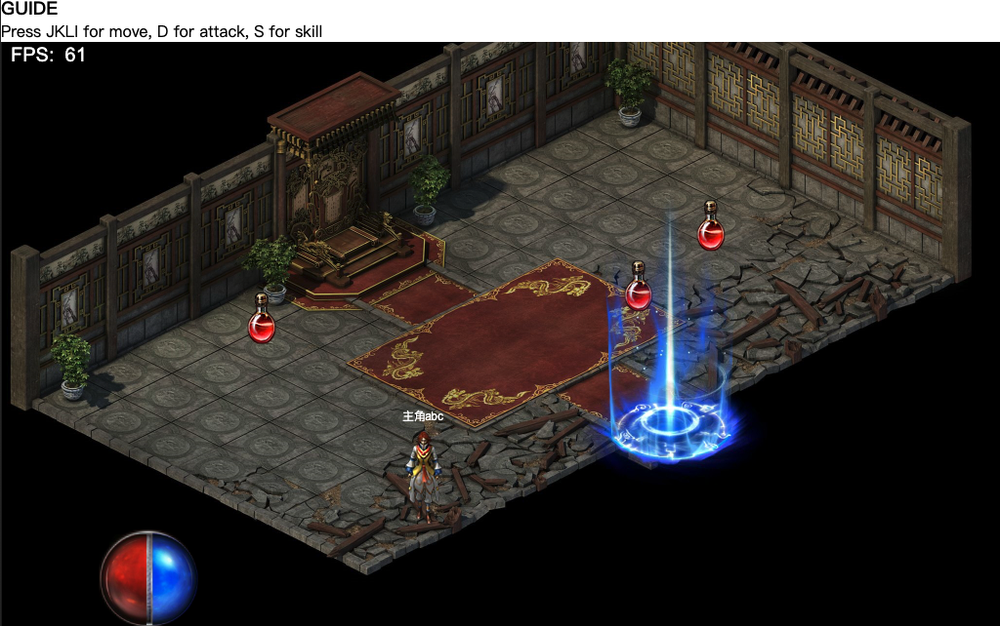

## 开篇

作为前端研发, 从jq时代末期,到vue,react兴起,rn跨端,小程序接力,搞来搞去都是这些东西着实有些疲倦。

从小到大接触到的游戏很多,想尝试写一个自己的游戏。

Unity跟UE上手成本高,用闲暇时间开发进展慢,设计资源贵(穷)。 Cocos,白鹭,上手快,但对底层实现不明白的话,感觉没多大意义。 因此打算自己用canvas加原生js,基于个人对游戏的理解,实现一个可交互的帧动画项目。如果可能,可以抽些功能做一个小引擎。

以下内容均是个人探索,一方面记录,另一方面分享给有同样兴趣的同仁。

ps: 2022年春节, 支付宝跟京东都搞了打年兽项目,仍然是营销场景,但是用户体验跟游戏无异,不清楚他们用了什么框架, 但是属于个人对可交互帧动画的定义。

  [可交互帧动画]
## 可交互帧动画

交互式帧动画是个人的一个定义, 本质是帧动画, 用户可以通过操作, 影响帧动画的结果, 实现交互功能。
简单的说,比如狂野飙车、马里奥赛车这种游戏,通用操作方向,帧动画的结果就是平稳的抵达终点或者撞车。

大部分游戏都可以理解成可交互帧动画这个概念, 用户使用设备实现交互, 体验不同的帧动画结果, 掌握技巧获取激励。
又比如说原神的一些过场动画,比如烤鱼活动H5,点击之后会有不同动画效果, 这也是交互式帧动画。

相信随着前端的逐(yue)步(lai)发(yue)展(juan),

可交互帧动画会成为提升用户体验的常见场景。

## 内容概览

· [初始化项目](/joaoBlog/game/0)

· [创建一个游戏对象](/joaoBlog/game/1)

· [创建一个动画对象](/joaoBlog/game/2)

· [资源加载,场景切换](/joaoBlog/game/3)

· [系统界面,物品界面](/joaoBlog/game/4)

## 目前进度
[github 静态页地址](https://murongqimiao.github.io/joaoStudio/)

